# Praktikum 12: Autentikasi dan Session 

## Nama: Syafarudiansya
## NIM: 312410381
## Kelas: TI 24 A6

### A. Persiapan Database

#### 1. Membuat Table User dan Insert Data Dummy
   
   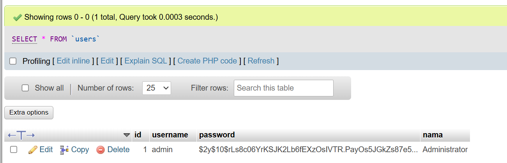

### B. Update Routing
```php
<?php
session_start(); // Aktifkan session di baris paling atas

include "config.php";
include "class/Database.php";
include "class/Form.php";

$path = isset($_SERVER['PATH_INFO'])
    ? $_SERVER['PATH_INFO']
    : '/home/index';

$segments = explode('/', trim($path, '/'));
$mod  = $segments[0] ?? 'home';
$page = $segments[1] ?? 'index';

$public_pages = ['home', 'user'];

if (!in_array($mod, $public_pages)) {
    if (!isset($_SESSION['is_login'])) {
        header('Location: /lab11_php_oop/user/login');
        exit;
    }
}

$file = "module/{$mod}/{$page}.php";

if (file_exists($file)) {

    if ($mod === 'user' && $page === 'login') {
        include $file;
    } else {
        include "template/header.php";
        include $file;
        include "template/footer.php";
    }

} else {
    echo "Halaman tidak ditemukan.";
}
```

### Membuat Model User (Log In & Log Out)

#### 1. Login.php
```php
<?php
// Cek jika sudah login, langsung ke home
if (isset($_SESSION['is_login'])) {
    header('Location: ../home/index');
    exit;
}

$message = "";

if ($_POST) {

    $db = new Database();

    $username = $_POST['username'];
    $password = $_POST['password'];

    $sql    = "SELECT * FROM users WHERE username = '{$username}' LIMIT 1";
    $result = $db->query($sql);
    $data   = $result->fetch_assoc();

    if ($data && password_verify($password, $data['password'])) {

    $_SESSION['is_login'] = true;
    $_SESSION['id']       = $data['id'];
    $_SESSION['username'] = $data['username'];
    $_SESSION['nama']     = $data['nama'];

    header('Location: ../artikel/index');
    exit;


    } else {
        $message = "Username atau password salah!";
    }
}
?>

<!DOCTYPE html>
<html lang="en">
<head>
    <meta charset="UTF-8">
    <title>Login System</title>

    <link
        href="https://cdn.jsdelivr.net/npm/bootstrap@5.3.0/dist/css/bootstrap.min.css"
        rel="stylesheet"
    >

    <style>
        .login-container {
            max-width: 400px;
            margin: 100px auto;
            padding: 20px;
            box-shadow: 0 0 10px rgba(0,0,0,0.1);
            border-radius: 8px;
        }
    </style>
</head>

<body>
<div class="login-container">

    <h3 class="text-center mb-4">Login User</h3>

    <?php if ($message): ?>
        <div class="alert alert-danger">
            <?= $message ?>
        </div>
    <?php endif; ?>

    <form method="POST" action="">
        <div class="mb-3">
            <label class="form-label">Username</label>
            <input
                type="text"
                name="username"
                class="form-control"
                required
            >
        </div>

        <div class="mb-3">
            <label class="form-label">Password</label>
            <input
                type="password"
                name="password"
                class="form-control"
                required
            >
        </div>

        <div class="d-grid">
            <button type="submit" class="btn btn-primary">
                Login
            </button>
        </div>
    </form>

    <div class="mt-3 text-center">
        <a href="../home/index">Kembali ke Home</a>
    </div>

</div>
</body>
</html>
```
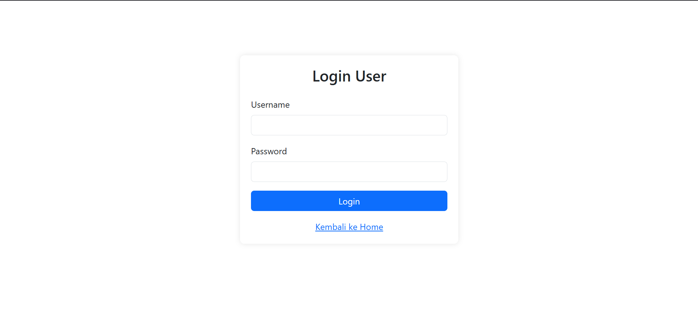

#### 2. Log out
```php
<?php
session_start();
session_destroy();
header('Location: ../user/login');
exit;
```

### C. Penyesuaian Header

```php
<div class="collapse navbar-collapse">

    <ul class="navbar-nav me-auto mb-2 mb-lg-0">
        <li class="nav-item">
            <a class="nav-link" href="../home/index">Home</a>
        </li>

        <?php if (isset($_SESSION['is_login'])): ?>
            <li class="nav-item">
                <a class="nav-link" href="/lab11_php_oop/artikel/index">
                    Data Artikel
                </a>
            </li>

            <!-- 🔥 TAMBAH INI -->
            <li class="nav-item">
                <a class="nav-link" href="/lab11_php_oop/user/profile">
                    Profil
                </a>
            </li>
        <?php endif; ?>
    </ul>

    <ul class="navbar-nav ms-auto">
        <?php if (isset($_SESSION['is_login'])): ?>
            <li class="nav-item">
                <a class="nav-link" href="../user/logout">
                    Logout (<?= $_SESSION['nama'] ?>)
                </a>
            </li>
        <?php else: ?>
            <li class="nav-item">
                <a class="nav-link" href="/lab11_php_oop/user/login">
                    Login
                </a>
            </li>
        <?php endif; ?>
    </ul>

</div>
```
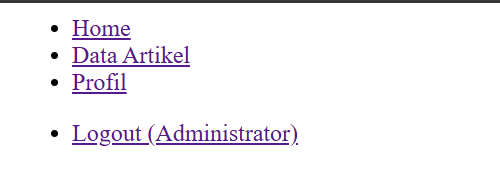

### E. Uji Coba
#### 1. Akses Login


#### 2. Login
Login dengan Username = admin dan Password = admin123

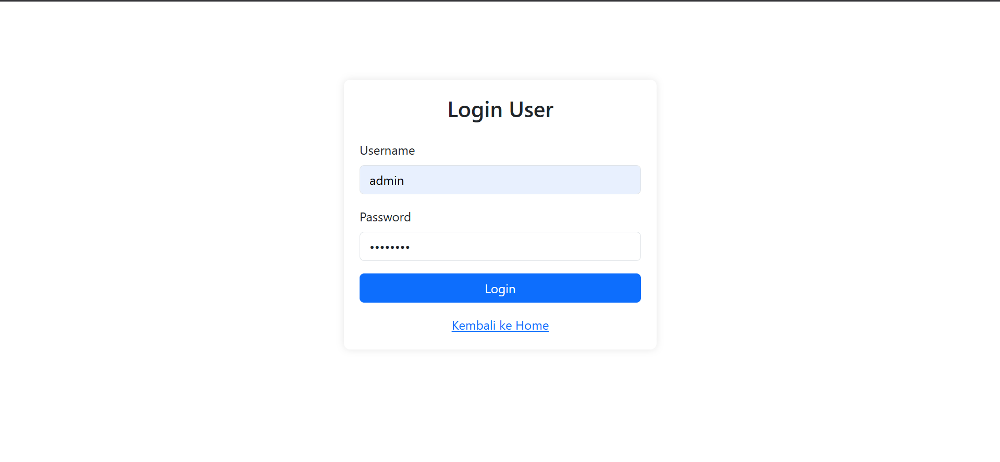
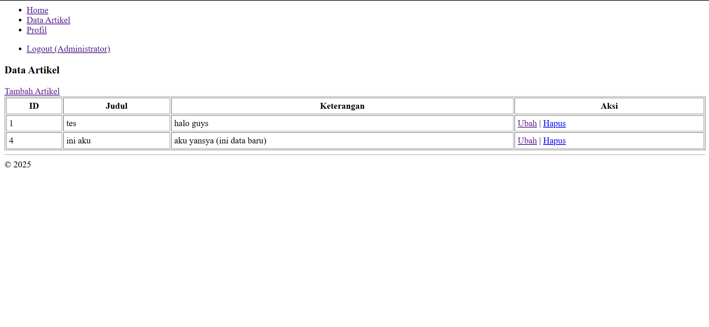

#### 3. CRUD
##### 1. Tambah
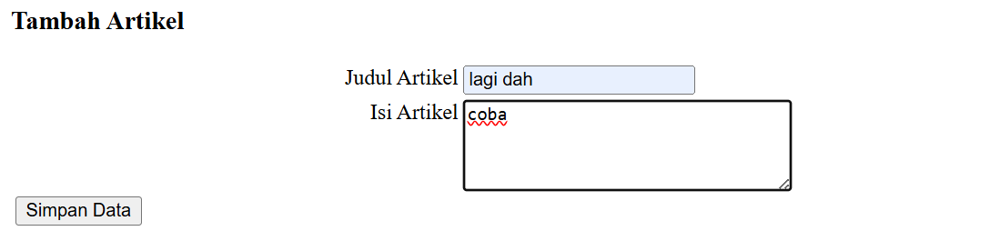
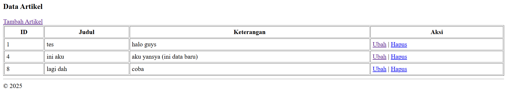

##### 2. Ubah
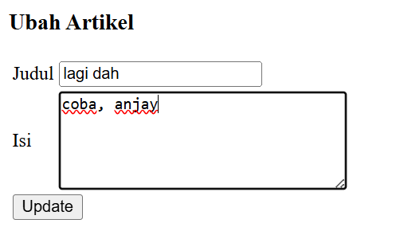
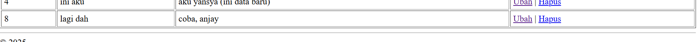

##### 3. Hapus
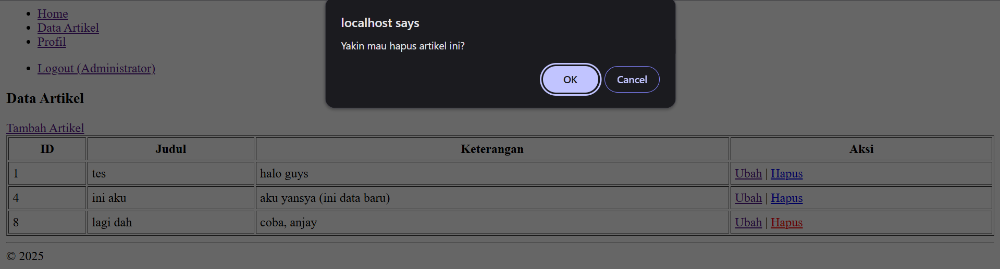
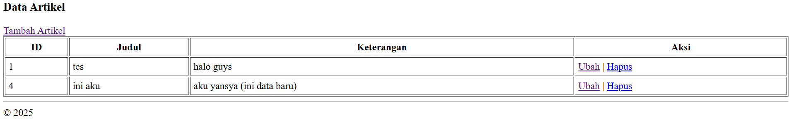

#### 4. Log out


### F. Tugas Praktikum

#### 1. Halaman Profil
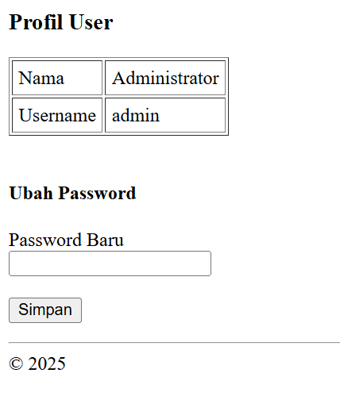

#### 2. Mengganti Password

Mengganti Password dari "admin123" menjadi "admin456"


